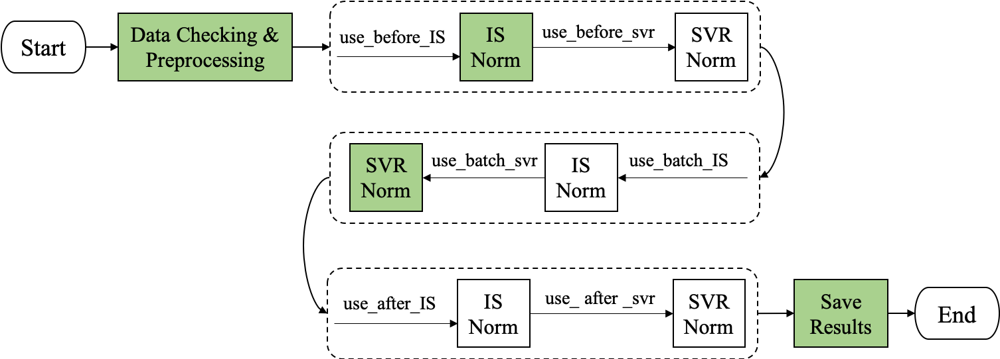

# Norm-ISWSVR


## Introduction
- Norm-ISWSVR can be used for large-scale untargeted & targeted metabolomics data normalization，removing the systematic errors. Such as batch effects，matrix effect， injection volume，instrument drift and et al.
- The main processing is shown in the figure below:
> Besides, this package supports `cross validation` and `hyper parameters tuning`.



Note: 
1. Boolean parameters `use_*` are configurable in using this package.
2. With color label of the rectangular is the default process, is also the recommended processing in our paper.
3. Patent has been applied, strictly prohibited for commercial use

## Install

```
git clone https://github.com/Dingxian666/Norm-ISWSVR.git
cd Norm-ISWSVR
python setup.py install
```

## Data Preparation
You should prepare your data as the following format:
- data.csv
> Examples: [demo-has-MatchedIS.csv](./examples/MatchedIS/demo-has-MatchedIS.csv) or [demo-no-MatchedIS.csv](./examples/NoMatchedIS/data-no-matchedIS.csv) 

Note: The `matchedIS` column is optional.

- sample.csv
> Examples: [sample-info.csv](./examples/MatchedIS/sample-info.csv)

Note: The `injection_order` & `batch` columns are optional.

## Usage Examples

- default
```
import ISWSVR
norm_iswsvr = ISWSVR.NormISWSVR(data_path='./examples/MatchedIS/demo-has-MatchedIS.csv',
                               sample_path='./examples/MatchedIS/sample-info.csv',
                               save_dir='./examples/results',
                               has_matched_IS=True)
norm_iswsvr.iswsvr()
```

- cross validation
```
import ISWSVR
norm_iswsvr = ISWSVR.NormISWSVR(data_path='./examples/MatchedIS/demo-has-MatchedIS.csv',
                               sample_path='./examples/MatchedIS/sample-info.csv',
                               save_dir='./examples/results',
                               has_matched_IS=True)
norm_iswsvr.run_with_cv_folds(fold_nums=5)
```

- hyper-parameters tuning with grid searching
```
import ISWSVR
norm_iswsvr = ISWSVR.NormISWSVR(data_path='./examples/MatchedIS/demo-has-MatchedIS.csv',
                               sample_path='./examples/MatchedIS/sample-info.csv',
                               save_dir='./examples/results',
                               has_matched_IS=True)
norm_iswsvr.run_with_grid_search(fold_nums=5,
                                result_save_path='./examples/grid_search_results.csv',
                                svr_top_corr_k=[1,2,3,4,5],
                                svr_gamma=['auto', 0.1, 0.2, 0.4, 0.5],
                                svr_C=[0.1, 0.2, 0.5, 1.0],
                                tuned_times=50)
```

**For more functions, please refer the function help during using, thank you!**

Please cite our paper if you find our work useful for your research:
[1] Ding, X.; Yang, F.; Chen, Y.; Xu, J.; He, J.; Zhang, R.; Abliz, Z., Norm ISWSVR: A Data Integration and Normalization Approach for Large-Scale Metabolomics. Analytical Chemistry 2022, 94 (21), 7500-7509.
